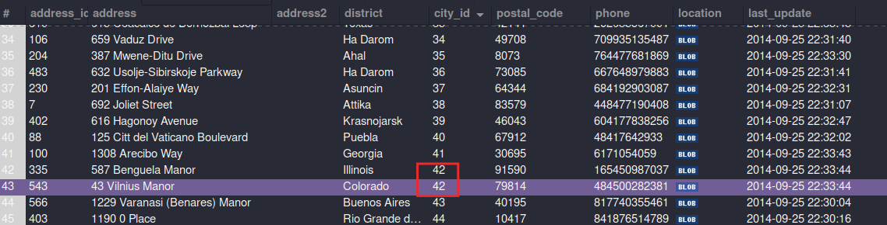

# Exercícios

Agora vamos abrir o **Workbench** e fazer uma análise prática do banco de dados **sakila**, que já deve estar instalado, caso você tenha feito a instalação do **MySql Workbench** de forma padrão. Caso o banco **sakila** não esteja disponível, volte até a seção **Restaurando o banco de dados de prática sakila** e siga as instruções listadas. Com esse banco disponível na sua instalação do **Workbench**, sua missão agora é tentar finalizar os exercícios a seguir!

## **Exercício 1**: Descubra como fazer uma pesquisa em qualquer tabela sem utilizar uma linha de código usando o **MySql Workbench**.

**Resposta**: Depois de abrir a conexão com o banco de dados, navegamos na guia "Schemas" e clicamos com o botão direito na tabela que desejamos fazer a pesquisa, no menu haverá a opção "Select Rows - Limit 1000", clicamos nesta. Abrirá uma janela contendo os primeiros 1000 registros dessa tabela e um campo para fazer filtros. Outra opção que temos ao clicar com o botão direito na tabela é "Search Table Data", que também possibilita fazer pesquisas na tabela sem escrever código.

## **Exercício 2**: Descubra como é possível criar uma tabela sem usar código **SQL** usando o **MySql Workbench**.

**Resposta**: Na guia "Schemas", ao expandir a que se deseja criar a tabela, temos o agrupamento "Tables", ao clicar com o botão direito neste temos a opção "Create Table...", clicando nesta opção aparece uma janela em que podemos criar as colunas e selecionar contraints, entre outras opções.

## **Exercício 3**: Feito isso, crie uma tabela com as seguintes restrições:

Nome da tabela: **Filme**

Colunas:
  * **FilmeId** - primary key, tipo int, incrementa por 1 cada vez que um valor é inserido automaticamente;
  * **Descricao** - não permite nulos, tipo texto (varchar(100);
  * **AnoLancamento** - não permite nulos, tipo int;
  * **Nota** - permite nulos, tipo int;

**Resposta**:

;
;

## **Exercício 4**: Analise a tabela **city** e encontre a tabela à qual a coluna **country_id** faz referência.

**Resposta**: A coluna country_id faz referência à coluna country_id da tabela country

## **Exercício 5**: Após resolver o exercício anterior, responda: qual tipo de relacionamento a tabela city faz com a tabela country?

**Resposta**: Relacionamento N-1, várias cidades podem ser do mesmo país.

## **Exercício 6**: Qual tipo de relacionamento a tabela **country** faz com a tabela **city**?

**Resposta**: Relacionamento 1-N, um país pode ter várias cidades.

## **Exercício 7**: Abra tabela por tabela do banco **sakila** e encontre no mínimo 3 exemplos de um relacionamentos 1:N ou N:1.

* Tabela **address**, relação de N:1 com a tabela **city**.

* Tabela **city**, relação de 1:N com a tabela **address**.

* Tabela **customer**, relação de N:1 com a tabela **store**.

* Tabela **store**, relação de 1:N com a tabela **customer**.

* Tabela **customer**, relação de 1:1 com a tabela **address**.

* Tabela **film**, relação de N:1 com a tabela **language**.
