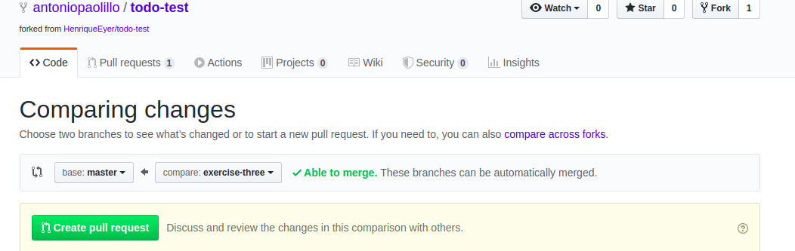

## Arquitetura de Software - Introdução ao MVC

### Antes de iniciar

Crie um fork desse projeto e para isso siga esse [tutorial de como realizar um fork](https://guides.github.com/activities/forking/).

Após feito o fork, clone o repositório criado para o seu computador.

Cada exercício tem sua pasta e dentro dela, você irá encontrar um `README.md`, com instruções de como realizar o exercício.

Antes de fazer cada exercício, siga os seguintes passos:

- Crie uma nova branch.
- Use `cd [diretório do exercicio]` para entrar no diretório do exercício.
- Execute `npm install` para instalar suas dependências.

Após a solução dos exercícios, abra um PR no seu repositório forkado e, se quiser, mergeie para a master, sinta-se a vontade!

**Atenção!** Quando for criar o PR você irá se deparar com essa tela:


É necessário realizar uma mudança. Clique no *base repository* como na imagem abaixo:


Mude para o seu repositório. Seu nome estará na frente do nome dele, por exemplo: `antonio/TicTacToe`. Depois desse passo a página deve ficar assim:



Agora basta criar o PULL REQUEST clicando no botão `Create Pull Request`.

Para cada PR realize esse processo.

### Revisando

**1 -** Primeiro vamos iniciar nosso servidor usando o express. Para isso, importe o express, depois, utilize o `express()` para criar uma instância do express e armazena-la na variável app. Agora, use o `app.listen()` para ouvir a porta 3000. Você pode passar um `console.log` com alguma frase como segundo argumento pra saber se seu servidor iniciou como deveria. 

**2 -** Agora precisamos criar o model que será responsável por fazer as requisições da nossa API de piada. Crie o diretório model e dentro dele crie um arquivo com o nome de `joke.js`. Nosso model terá apenas 1 função, a função `getJokes()`. Essa função faz uma chamada no endpoint "https://sv443.net/jokeapi/v2/joke/Programming?blacklistFlags=nsfw,religious,political,racist,sexist&type=single" utilizando o ***axios***. O axios retorna a informação dentro da propriedade data. Essa propriedade será algo parecido com isso:

```json
{
  "error": false,
  "category": "Programming",
  "type": "single",
  "joke": "There are only 10 kinds of people in this world: those who know binary and those who don't.",
  "flags": {
    "nsfw": false,
    "religious": false,
    "political": false,
    "racist": false,
    "sexist": false
  },
  "id": 35,
  "lang": "en"
}
```

Assim, nossa função deve retornar a propriedade `data.joke` da requisição do axios.

**3 -** Com o model criado, está na hora de criar um controller. O controller de uma rota controla o que acontece quando uma requisição acontece, assim,a função do nosso controller será receber a requisição, chamar a função `getJokes()` do model, e renderizar uma `view` com a piada retornada. Ok, vamos devagar. Primeiro, crie a função. Como o endpoint que usaremos tem a função de listar as piadas, chame a função de `listJokes` e não se esqueça, ela deve receber 2 parâmetros, `req` e `res`. Agora, dentro do escopo da nossa função, chamaremos a função getJokes() do model. Não se esqueça de usar o async/await ou o .then() para controlar o fluxo!. Já já vamos voltar pra criar a resposta, mas antes disso, vamos criar uma view!

**DICA:** Nossa função não usará nenhum dado da requisição, logo o parâmetro req não será utilizado. Para mostrar que voce não tem a intenção de usar um parâmetro, você pode utilizar um _ antes dele. Por exemplo, nosso função ficaria assim: `listJokes(_req, res)`

**4 -** Vamos a view! Primeiro, vamos avisar ao express que pretendemos usar o ejs como engine para renderizar nossa views. Para isso, no nosso arquivo `index.js` vamos chamar a função `app.set('view engine', 'ejs')`. Agora, precisamos informar o express onde procurar por views quando for pedido para renderizá-las. Para isso, ainda no arquivo `index.js` usaremos um `app.set('views', './views');`. Pronto, agora que já configuramos, vamos criar a view de fato!

**5 -** Crie a pasta views e dentro dela crie o arquivo `jokeView.ejs`. Dentro do arquivo, crie a estrutura padrão do HTML. Lembre-se, um arquivo `ejs` funciona como um `HTML`, só que com algumas "habilidades especiais". Para nossa view, vamos apenas mostrar na página a piada dentro de uma tag `h1`, assim, no body, crie a tag `h1` e dentro vamos colocar a variável `joke`. Lembre-se que pra isso, temos que usar a estrutura especial `<%= %>`.

**6 -** Com a view criada, esta na hora de usá-la no controller. No final do controller vamos retornar como resposta nossa view, assim, use um `return res.render()`. O `render` deve receber 2 argumentos. O primeiro é o caminho da nossa view. Lembre-se que deve ser uma string e que o caminho toma como base a pasta views, já que foi nela que configuramos nosso express pra procurar. No nosso caso, o primeiro argumento será apenas 'jokeView.ejs'. O segundo argumento é um objeto com as variáveis que desejamos passar para nossa view. Como só usamos uma variável na view, a variável `joke`, temos que passar como segundo argumento { joke }. Com isso, nosso controller esta pronto pra uso! Como ultimo passo, só precisamos passar pro express a rota que será controlada por esse controller.

**7 -** No arquivo `index.js`, vamos juntar rota e controler. Para isso vamos usar o `app.get()`, vamos passar 2 argumentos para ele , o primeiro será nossa rota. Como ela será única, podemos usar o '/'. O segundo é controller. Importe-o e passeo como segundo argumento. Lembre-se que é uma callback, então voce não utilizará o () no final.

### Piadas Chuck Norris

Vamos criar uma aplicação simples que faz chamadas a uma [API de piadas sobre o Chuck Norris](https://api.chucknorris.io/). A aplicação terá 2 "partes". Uma que mostra as categorias das piadas e direciona a pessoa para a segunda parte, onde a chamada da API de piadas é feita e a piada é de fato retornada. Então, vamos lá ?

#### Parte 1

Vamos começar fazendo a parte das categorias. Para essa parte já criamos a view para você!

- Primeiro crie uma pasta models e nela crie um model para as categorias. Nele deve haver uma função que faz uma chamada a API de categorias.

- Agora, vamos criar o controller. Lembre-se que o controller tem como uma de suas funções unificar o model com nossa view.
Importe o model das categorias e use a função criada anteriormente para obter uma lista de categorias. Depois, utilize o `res.`render para renderizar a view de categorias e passar a variável categories para ela. A view se encontra na pasta `views/categories`.

- Agora, no nosso arquivo `index.js` vamos usar o controller que acabamos de criar. Ele deve estar ligado ao endpoint `/categories`. Não se esqueça de usar o express para realizar e o ejs como template engine.

- Para finalizar, vamos criar mais uma função no controller de categorias. Queremos que ao acessar o endpoint '/', o usuário seja levado para o endpoint '/categories', crie uma função que faça esse redirecionamento. 
DICA: Olhe a função `res.redirect()` na documentação do express.

---

#### Parte 2

Agora vamos as piadas em si. Essa etapa será um pouco menos descritiva e dessa vez você terá que fazer as 3 partes do modelo MVC: a view, o controller e o model.

- O model das piadas deve fazer chamadas para o endpoint de piada aleatório e para o endpoint de piada por categoria.

- A view deve conter pelo menos 2 campos, um botão para voltar para a página de categorias e um campo onde vai exibir a piada retornada pela API

- O endpoint `/jokes` deve retornar uma piada aleatória sem categoria específica ( o que corresponde ao link da categoria all ) e os endpoints `/jokes/:categories` deve exibir uma piada de uma categoria específica, que vem como parêmetro da URL.
