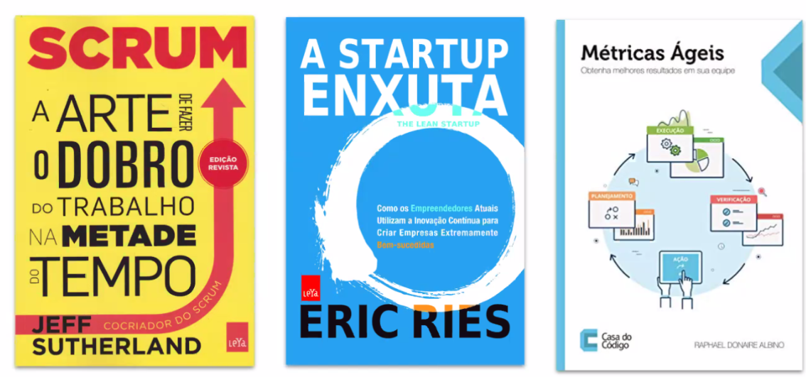

# Resumo

Hoje aprendemos sobre Scrum e Kanban. Tivemos uma aula sobre como usar o GitHub no contexto de time e a usar ferramentas como o Trello para gerenciar as tasks.

## Materiais que foram recomendados:

[Manifesto Ágil](https://agilemanifesto.org/iso/ptbr/manifesto.html)

[Os 12 princípios do Manifesto Ágil](https://www.youtube.com/watch?v=e4VYnCRU25E)

[Qual a melhor maneira de aprender Métodos Ágeis?](https://www.youtube.com/watch?v=1WLnP5lpBPQ)

[O que é o Scrum?](https://www.desenvolvimentoagil.com.br/scrum/)

[What is Kanban?](https://www.digite.com/kanban/what-is-kanban)

[O que é Gestão por resultados?](https://blog.runrun.it/gestao-por-resultados/)

[Como o kanban pode ser usado por uma equipe de marketing](https://blog.runrun.it/kanban-board-para-marketing/)

[When Is Kanban Better Than Scrum?](https://medium.com/@mdalmijn/when-is-it-better-to-use-kanban-than-scrum-d5032b658ac3)

[A pretty good summary of Lean, Agile, Scrum](https://medium.com/@takeshi.yoshida/a-pretty-good-summary-of-lean-agile-scrum-168cf123748)

[Aprenda mais sobre Backlog e sua importância](https://blog.runrun.it/o-que-e-backlog/)
[Vídeo - Decifrando Agile 1 - Por que e quando usar Métodos Ágeis?](https://www.youtube.com/watch?v=efZlpew90Nk)

[Vídeo - Entenda o que são os métodos ágeis em 5 minutos [Decifrando Agile 2]](https://www.youtube.com/watch?v=ds_FydzsuO8)

[Vídeo - Kanban: exemplo de uso no Trello. | Ep. 210.](https://www.youtube.com/watch?v=7JRB33f_M3k)

## Livros recomendados

  

