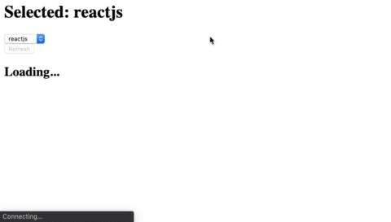

# Exercícios

## Agora a prática

1. Hora de colocar em prática tudo que você aprendeu até então, fazendo [o exercício de fixação deste repositório](https://github.com/tryber/exercise-redux-thunk).

2. Vamos fazer uma pequena aplicação que nos permitirá buscar informações sobre os personagens da famosa série de livros "As Crônicas de Gelo e Fogo", que gerou a famosa série Game of Thrones.

No repositório linkado abaixo você encontrará alguns componentes React prontos e maiores informações a respeito. Vamos lá, pois O inverno está chegando.

[Link do repositório](https://github.com/tryber/exercise-game-of-thrones-characters)

## Bônus

Como Redux exige muita prática, eis aqui mais um exercício! Desta vez, um mini-projeto para se desenvolver e guardar no portfólio!

Conhece o [Reddit](https://reddit.com/) ? É uma comunidade na qual pessoas conseguem criar grupos de discussão acerca de algum assunto. Tal grupo é chamado de **subreddit**. Para cada **subreddit** pessoas podem fazer postagens ( **posts** ). Como exercício, você vai fazer uma aplicação que permite a quem usá-la ver **posts** referentes a **2 subreddits** :

1. **reactjs**

2. **frontend**

Sua aplicação deve permitir a quem usá-la poder escolher de qual **subreddit** se deseja ver as postagens. No momento que selecionar o **subreddit**, uma requisição precisa ser feita no **reddit** para buscar os **posts** referentes ao **subreddit** escolhido. Para cada postagem você precisa mostrar **pelo menos** o título do **post**. Além disso, sua aplicação deve permitir a quem usá-la a possibilidade de **atualizar** a lista de postagens referentes ao **subreddit** escolhido.

É **obrigatório** que você gerencie o estado de sua aplicação com **Redux**, guardando os **subreddits**, assim como os **posts** de cada **subreddit**, no **store**. Você precisa fazer uso do **redux-thunk** para permitir criar **actions** assíncronas.

**Pontos importantes:**

1. Para buscar os **posts** referentes a um **subreddit**, você pode fazer uma requisição **GET** para `https://www.reddit.com/r/<subreddit>.json`. Ou seja, se você precisar buscar posts do **subreddit reactjs**, você faria uma chamada para `https://www.reddit.com/r/reactjs.json`.

* No **json** retornado você encontra os dados referentes aos **posts** dentro da propriedade **data.children**. Para cada post dentro de **data.children** você encontra seu título correspondente na propriedade **data.title**.

2. Antes de começar a sair implementando, **pare e pense** sobre **como** desenhar o estado da sua aplicação. O que você precisa guardar no estado? Como você vai **estruturar** e **organizar** seus dados? Quais **actions** você precisa ter para **modelar** os eventos que ocorrerão na sua aplicação (fazer uma requisição, obter sua resposta, atualizar a lista, etc...)? Como você vai organizar seus **reducers** (lembrando que **NUNCA** deve-se alterar o estado, e sim **criar** um [novo](https://redux.js.org/introduction/three-principles#changes-are-made-with-pure-functions))?

3. Como você está fazendo uma requisição de um recurso externo, o que acontece se a requisição de postagens referentes a um **subreddit** falhar? Adicione na sua aplicação tratamento de erro para esses casos, salvando no estado da sua aplicação a mensagem de erro para o **subreddit** correspondente. Dica: procure e **investigue** no Google como fazer tratamento de erro de requisição no contexto de **Redux**.

4. Como forma de ter um melhor diagnóstico sobre o fluxo de dados em uma aplicação **Redux**, instale o middleware [redux-logger](https://github.com/LogRocket/redux-logger) e o integre na sua aplicação.

5. Instale a extensão do Chrome [redux-dev-tools](https://github.com/zalmoxisus/redux-devtools-extension) e a integre na sua aplicação. Com isso, você tem um ambiente completo para poder analisar e depurar sua aplicação. 🚀

É mostrada em sequência uma sugestão de implementação da aplicação.

 

