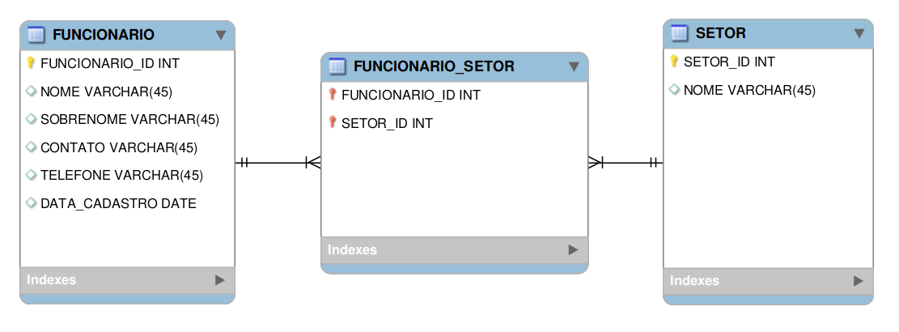
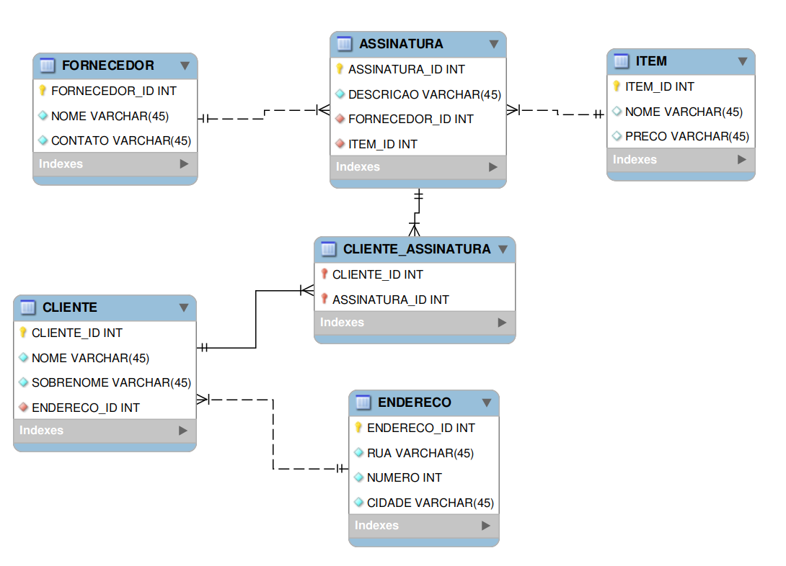

# Atividades

## Para fixar - normalização de dados

Vamos consolidar toda a explicação passada até o momento através de alguns desafios.

### 1. Normalize a tabela a seguir para a 1ª Forma Normal. Não se preocupe em montar a estrutura em código SQL neste primeiro momento. Crie apenas uma planilha (Excel, Google Sheets, Open Office Calc ou semelhantes) da estrutura esperada.

Funcionario_id | Nome | Sobrenome | Contato | Contato | DataCadastro | Setor
-------------- | ---- | --------- | ------- | -------- | ------------- | ----------
12 | Joseph | Rodrigues | jo@gmail.com | (35)998552-1445 | 2020-05-05 08:50:25 | Administração, Vendas
13 | André | Freeman | andre1990@gmail.com | (47)99522-4996 | 5 de Fevereiro de 2020 | Operacional
14 | Cíntia | Duval | cindy@outlook.com | (33)99855-4669 | 2020-05-05 10:55:35 | Estratégico, Vendas
15 | Fernanda | Mendes | fernandamendes@yahoo.com | (33)99200-1556 | 2020-05-05 11:45:40 | Marketing

**Resposta:**

Colunas devem possuir apenas um valor, então foi criada uma tabela para setores e outra intemediária para relacionar setor e funcionário (N-N).

A tabela não pode ter duas colunas com o mesmo nome, portanto, renomeei uma das colunas Contato para Telefone.

A coluna deve ter somente dados de um tipo, portanto, na coluna DataCadastro foi ajustada a data do funcionário com id 13;



* **FUNCIONARIO**

Funcionario_id | Nome | Sobrenome | Contato | Telefone | DataCadastro
-------------- | ---- | --------- | ------- | -------- | -------- 
12 | Joseph | Rodrigues | jo@gmail.com | (35)998552-1445 | 2020-05-05 08:50:25
13 | André | Freeman | andre1990@gmail.com | (47)99522-4996 | 2020-02-05 00:00:00
14 | Cíntia | Duval | cindy@outlook.com | (33)99855-4669 | 2020-05-05 10:55:35
15 | Fernanda | Mendes | fernandamendes@yahoo.com | (33)99200-1556 | 2020-05-05 11:45:40

<br>

* **SETOR**

Setor_id | Nome
---------| ----
1 | Administração
2 | Vendas
3 | Operacional
4 | Estratégico
5 | Marketing

<br>

* **FUNCIONARIO_SETOR**

Funcionario_id | Setor_id
-------------- | --------
12 | 1
12 | 2
13 | 3
14 | 4
14 | 2
15 | 5

### 2. Usando a estrutura (já normalizada para 1ª Forma Normal) da tabela anterior, transforme-a agora na 2ª Forma Normal.

A tabela resultante do exercício anterior já atende os requisitos da 2ª Forma Normal.

### 3. Monte uma query que:

* Crie um banco de dados chamado **normalization**;
* Crie todas as tabelas resultantes do exercício 2 (na 2ª Forma Normal);
* Popule todas as tabelas com os dados fornecidos nos exercícios.

```sql
DROP DATABASE IF EXISTS normalization;
CREATE DATABASE normalization;
USE normalization;

CREATE TABLE FUNCIONARIO (
  FUNCIONARIO_ID INT NOT NULL PRIMARY KEY AUTO_INCREMENT,
  NOME VARCHAR(45) NOT NULL,
  SOBRENOME VARCHAR(45) NOT NULL,
  CONTATO VARCHAR(45) NOT NULL,
  TELEFONE VARCHAR(45) NOT NULL,
  DATA_CADASTRO DATETIME DEFAULT NOW()
) AUTO_INCREMENT=12 ENGINE=InnoDB;

CREATE TABLE SETOR (
  SETOR_ID INT NOT NUll PRIMARY KEY AUTO_INCREMENT,
  NOME VARCHAR(45) NOT NULL
) ENGINE=InnoDB;

CREATE TABLE FUNCIONARIO_SETOR (
  FUNCIONARIO_ID INT NOT NULL,
  SETOR_ID INT NOT NULL,
  PRIMARY KEY (FUNCIONARIO_ID, SETOR_ID),
  FOREIGN KEY (FUNCIONARIO_ID) REFERENCES FUNCIONARIO(FUNCIONARIO_ID),
  FOREIGN KEY (SETOR_ID) REFERENCES SETOR(SETOR_ID)
) ENGINE=InnoDB;

INSERT INTO SETOR (NOME)
VALUES
  ("Administração"),
  ("Vendas"),
  ("Operacional"),
  ("Estratégico"),
  ("Marketing");

INSERT INTO FUNCIONARIO (
  NOME,
  SOBRENOME,
  CONTATO,
  TELEFONE,
  DATA_CADASTRO
) 
VALUES
  ('Joseph', 'Rodrigues', 'jo@gmail.com', '(35)998552-1445', CAST('2020-05-05 08:50:25' AS DATETIME)),
  ('André', 'Freeman', 'andre1990@gmail.com', '(47)99522-4996', CAST('2020-02-05 00:00:00' AS DATETIME)),
  ('Cíntia', 'Duval', 'cindy@outlook.com', '(33)99855-4669', CAST('2020-05-05 10:55:35' AS DATETIME)),
  ('Fernanda', 'Mendes', 'fernandamendes@yahoo.com', '(33)99200-1556', CAST('2020-05-05 11:45:40' AS DATETIME));

INSERT INTO FUNCIONARIO_SETOR (
  FUNCIONARIO_ID,
  SETOR_ID
)
VALUES
  (12, 1),
  (12, 2),
  (13, 3),
  (14, 4),
  (14, 2),
  (15, 5);
```

## Para fixar - dump

Selecione um dos bancos de dados já existentes no seu servidor local ( **w3schools**, **northwind**, **sakila**, **hr**, etc.) e faça os passos a seguir:

1. Exporte **a estrutura e os dados** (tabelas, triggers, procedures, functions e o schema ) para um dump em formato de arquivo SQL, como foi exibido nas instruções anteriores. Faça o dump através da linha de comando e usando o **MySQL Workbench**.

```bash
mysqldump -u root -p --triggers --routines --databases --add-drop-table w3schools > w3schools.sql
```

Pelo **MySQL Workbench** o dump é feito em Administration > Data Export.

2. Após ter feito isso, abra o arquivo usando algum editor de texto e altere as duas linhas iniciais, mudando o nome do banco a ser criado e do banco a ser usado. Assim seu script vai restaurar um banco novo e não sobrescrever o atual.

  * No exemplo abaixo, foi feito o backup do banco de dados **hotel**. Após ser gerado o backup, o arquivo foi aberto, e o nome do banco a ser criado foi alterado para **hotel2**. A linha `USE hotel` também foi alterada para `USE hotel2`.


```bash
sed -i -e 's/w3schools/w3schoolsClone/g' w3schools.sql
mysql -u root -p < w3schools.sql
```

3. Confira que, ao executar os comandos para restaurar o **dump**, um novo banco de dados foi criado, como na imagem abaixo.


Resultado:


## Exercícios

Os exercícios abaixo estão disponibilizados em arquivos no formato Excel (.xlsx). Eles podem ser abertos em softwares livres como Google Sheets, Open Office e Libre Office. Não é necessário montar queries para resolver os exercícios. Crie novas planilhas com suas respostas.

1. Converta [esta tabela](https://s3.us-east-2.amazonaws.com/assets.app.betrybe.com/back-end/sql/normalization/tables/0-Tabela-Nao-Normalizada-64d4c1204f54398b17ca0522fbfb2abf.xlsx) para a 1ª Forma Normal. Após tentar resolver, consulte [aqui](https://s3.us-east-2.amazonaws.com/assets.app.betrybe.com/back-end/sql/normalization/tables/1-Primeira-Forma-Normal-3eec2d3168edeab92a61e321284da344.xlsx) a resposta.

2. Converta a tabela construída no exercício anterior (que já deve estar na 1ª Forma Normal) para a 2ª Forma Normal. Após tentar resolver, consulte [aqui](https://s3.us-east-2.amazonaws.com/assets.app.betrybe.com/back-end/sql/normalization/tables/2-Segunda-Forma-Normal-77b3c03c154477fd1caa2aed02bcac6c.xlsx) a resposta.

3. Agora, converta essa nova tabela (que já deve estar na 2ª Forma Normal) para a 3ª Forma Normal. Após tentar resolver, consulte [aqui](https://s3.us-east-2.amazonaws.com/assets.app.betrybe.com/back-end/sql/normalization/tables/3-Terceira-Forma-Normal-d773b59282152f416d01f7446b39326d.xlsx) a resposta.

**Resposta dos exercícios 1 ao 3**:



```sql
DROP DATABASE IF EXISTS assinaturas;
CREATE DATABASE assinaturas;
USE assinaturas;

CREATE TABLE ENDERECO (
  ENDERECO_ID INT NOT NULL PRIMARY KEY AUTO_INCREMENT,
  RUA VARCHAR(45) NOT NULL,
  NUMERO INT NOT NULL,
  CIDADE VARCHAR(45) NOT NULL
);

CREATE TABLE CLIENTE (
  CLIENTE_ID INT NOT NULL PRIMARY KEY AUTO_INCREMENT,
  NOME VARCHAR(45) NOT NULL,
  SOBRENOME VARCHAR(45) NOT NULL,
  ENDERECO_ID INT NOT NULL,
  FOREIGN KEY (ENDERECO_ID) REFERENCES ENDERECO(ENDERECO_ID)
);

CREATE TABLE FORNECEDOR (
  FORNECEDOR_ID INT NOT NULL PRIMARY KEY AUTO_INCREMENT,
  NOME VARCHAR(45) NOT NULL,
  CONTATO VARCHAR(45) NOT NULL
);

CREATE TABLE ITEM (
  ITEM_ID INT NOT NULL PRIMARY KEY AUTO_INCREMENT,
  NOME VARCHAR(45),
  PRECO VARCHAR(45)
);

CREATE TABLE ASSINATURA (
  ASSINATURA_ID INT NOT NULL PRIMARY KEY AUTO_INCREMENT,
  DESCRICAO VARCHAR(45) NOT NULL,
  FORNECEDOR_ID INT NOT NULL,
  ITEM_ID INT NOT NULL,
  FOREIGN KEY (FORNECEDOR_ID) REFERENCES FORNECEDOR(FORNECEDOR_ID),
  FOREIGN KEY (ITEM_ID) REFERENCES ITEM(ITEM_ID)
);

CREATE TABLE CLIENTE_ASSINATURA (
  CLIENTE_ID INT NOT NULL,
  ASSINATURA_ID INT NOT NULL,
  PRIMARY KEY (CLIENTE_ID, ASSINATURA_ID),
  FOREIGN KEY (CLIENTE_ID) REFERENCES CLIENTE(CLIENTE_ID),
  FOREIGN KEY (ASSINATURA_ID) REFERENCES ASSINATURA(ASSINATURA_ID)
);

INSERT INTO FORNECEDOR (NOME, CONTATO)
VALUES
  ('Microsoft', '47-998556995'),
  ('Sony', '33-525979855');
  
INSERT INTO ITEM (NOME, PRECO)
VALUES
  ('XBOX', 1850),
  ('PlayStation', 2100);
  
INSERT INTO ENDERECO (RUA, NUMERO, CIDADE)
VALUES
  ('Rua Norte Sul', 35, 'Belo Horizonte'),
  ('Av Rodrigues Ramos', 950, 'Bahia'),
  ('Rua Brusque', 352, 'Ipatinga'),
  ('Av Atlantica', 254, 'Camboriú');
  
INSERT INTO CLIENTE (NOME, SOBRENOME, ENDERECO_ID)
VALUES
  ('Doren', 'Fatima', 1),
  ('Ramon', 'Jonathan', 2),
  ('Vanderson', 'Judis', 3),
  ('Carolina', 'Rude', 4);
  
INSERT INTO ASSINATURA (DESCRICAO, FORNECEDOR_ID, ITEM_ID)
VALUES
  ('Lançamentos XBOX', 1, 1),
  ('Lançamentos Sony', 2, 2);
  
INSERT INTO CLIENTE_ASSINATURA (CLIENTE_ID, ASSINATURA_ID)
VALUES
  (1, 1),
  (2, 2),
  (3, 1),
  (3, 2),
  (4, 2);
```

4. Converta para a 3ª Forma Normal a tabela [deste exercício do site Gitta](http://www.gitta.info/LogicModelin/en/html/DataConsiten_selfAssessment5.html).

UnitID | StudentID | Date | TutorID | Topic | Room | Grade | Book | TutEmail
------ | --------- | ---- | ------- | ----- | ---- | ----- | ---- | -------- 
U1 | St1 | 23.02.03 | Tut1 | GMT | 629 | 4.7 | Deumlich | tut1@fhbb.ch
U2 | St1 | 18.11.02 | Tut3 | GIn | 631 | 5.1 | Zehnder | tut3@fhbb.ch
U1 | St4 | 23.02.03 | Tut1 | GMT | 629 | 4.3 | Deumlich | tut1@fhbb.ch
U5 | St2 | 05.05.03 | Tut3 | PhF | 632 | 4.9 | Dümmlers | tut3@fhbb.ch
U4 | St2 | 04.07.03 | Tut5 | AVQ | 621 | 5.0 | SwissTopo | tut5@fhbb.ch

**Resposta:**

OBS: Exercício resolvido em dupla com minha amiga [Rosiele](https://github.com/rosids) :D


```sql
DROP DATABASE IF EXISTS grades;
CREATE DATABASE grades;
USE grades;

CREATE TABLE BOOK (
  BOOK_ID INT NOT NULL PRIMARY KEY AUTO_INCREMENT,
  NAME VARCHAR(45) NOT NULL
) ENGINE = InnoDB;

CREATE TABLE STUDENT (
  STUDENT_ID INT NOT NULL PRIMARY KEY AUTO_INCREMENT,
  `NAME` VARCHAR(45) NOT NULL
) ENGINE = InnoDB;

CREATE TABLE ROOM (
  ROOM_ID INT NOT NULL PRIMARY KEY AUTO_INCREMENT,
  NUMBER INT NOT NULL
) ENGINE = InnoDB;

CREATE TABLE TOPIC (
  TOPIC_ID INT NOT NULL PRIMARY KEY AUTO_INCREMENT,
  `NAME` VARCHAR(45) NOT NULL,
  ROOM_ID INT NOT NULL,
  BOOK_ID INT NOT NULL,
  FOREIGN KEY (ROOM_ID) REFERENCES ROOM(ROOM_ID),
  FOREIGN KEY (BOOK_ID) REFERENCES BOOK(BOOK_ID)
) ENGINE = InnoDB;

CREATE TABLE TUTOR (
  TUTOR_ID INT NOT NULL PRIMARY KEY AUTO_INCREMENT,
  `NAME` VARCHAR(45) NOT NULL,
  EMAIL VARCHAR(45) NOT NULL
) ENGINE = InnoDB;

CREATE TABLE UNIT (
  UNIT_ID INT NOT NULL PRIMARY KEY AUTO_INCREMENT,
  TOPIC_ID INT NOT NULL,
  `DATE` DATE NOT NULL,
  FOREIGN KEY (TOPIC_ID) REFERENCES TOPIC(TOPIC_ID)
) ENGINE = InnoDB;

CREATE TABLE STUDENT_UNIT (
  STUDENT_ID INT NOT NULL,
  UNIT_ID INT NOT NULL,
  GRADE DECIMAL(3, 1),
  PRIMARY KEY (STUDENT_ID, UNIT_ID),
  FOREIGN KEY (STUDENT_ID) REFERENCES STUDENT(STUDENT_ID),
  FOREIGN KEY (UNIT_ID) REFERENCES UNIT(UNIT_ID)
) ENGINE = InnoDB;

CREATE TABLE UNIT_TUTOR (
  UNIT_ID INT NOT NULL,
  TUTOR_ID INT NOT NULL,
  PRIMARY KEY (UNIT_ID, TUTOR_ID),
  FOREIGN KEY (UNIT_ID) REFERENCES UNIT(UNIT_ID),
  FOREIGN KEY (TUTOR_ID) REFERENCES TUTOR(TUTOR_ID)
) ENGINE = InnoDB;

INSERT INTO BOOK (`NAME`)
VALUES
  ('Deumlich'),
  ('Zehnder'),
  ('Dümmlers'),
  ('SwissTopo');
  
INSERT INTO ROOM (`NUMBER`)
VALUES
  (629),
  (631),
  (632),
  (621);

INSERT INTO STUDENT (STUDENT_ID, `NAME`)
VALUES
  (1, 'St1'),
  (4, 'St4'),
  (2, 'St2');
  
INSERT INTO TUTOR (TUTOR_ID, `NAME`, EMAIL)
VALUES
  (1, 'Tut1', 'tut1@fhbb.ch'),
  (3, 'Tut3', 'tut3@fhbb.ch'),
  (5, 'Tut5', 'tut5@fhbb.ch');

INSERT INTO TOPIC (`NAME`, ROOM_ID, BOOK_ID)
VALUES
  ('GMT', 1, 1),
  ('GIn', 2, 2),
  ('PhF', 3, 3),
  ('AVQ', 4, 4);

INSERT INTO UNIT (UNIT_ID, TOPIC_ID, `DATE`)
VALUES
  (1, 1, DATE('23-02-03')),
  (2, 2, DATE('18-11-02')),
  (4, 4, DATE('04-07-03')),
  (5, 3, DATE('05-05-03'));

INSERT INTO UNIT_TUTOR (UNIT_ID, TUTOR_ID)
VALUES
  (1, 1),
  (2, 3),
  (5, 3),
  (4, 5);

INSERT INTO STUDENT_UNIT (STUDENT_ID, UNIT_ID, GRADE)
VALUES
  (1, 1, 4.7),
  (1, 2, 5.1),
  (4, 1, 4.3),
  (2, 5, 4.9),
  (2, 4, 5);
```

## Bônus

5. Faça os exercícios sobre normalização (em inglês) [deste link](https://www.javaguicodexample.com/normalizationnotes.pdf).
