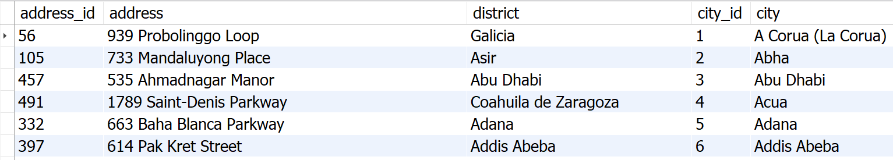
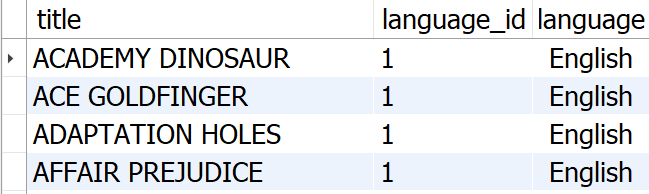
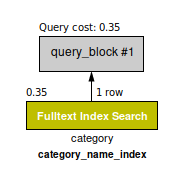
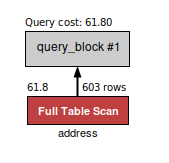

# Atividades

## Desafios sobre `VIEW`

1. Crie uma view chamada **film_with_categories** utilizando as tabelas **category**, **film_category** e **film** do banco de dados **sakila**. Essa view deve exibir o **título** do filme, o **id** da categoria e o **nome** da categoria, conforme a imagem abaixo. Os resultados devem ser ordenados pelo **título** do filme.


**_Resultado de exemplo para uma consulta na view do exercício 1_**

```sql
USE sakila;

CREATE VIEW film_with_categories AS
SELECT
  F.title, C.category_id, C.`name`
FROM sakila.film_category AS FC
INNER JOIN sakila.film AS F
ON FC.film_id = F.film_id
INNER JOIN sakila.category AS C
ON FC.category_id = C.category_id
ORDER BY F.title;

SELECT * FROM film_with_categories;
```

2. Crie uma view chamada **film_info** utilizando as tabelas **actor**, **film_actor** e **film** do banco de dados **sakila**. Sua view deve exibir o **actor_id**, o nome completo do ator ou da atriz em uma coluna com o **ALIAS actor** e o título dos filmes. Os resultados devem ser ordenados pelos nomes de atores e atrizes. Use a imagem a seguir como referência.


**_Resultado de exemplo para uma consulta na view do exercício 2_**

```sql
USE sakila;

CREATE VIEW film_info AS
SELECT
  A.actor_id,
  CONCAT(A.first_name, ' ', A.last_name) AS actor,
  F.title
FROM film_actor AS FA
INNER JOIN actor AS A
ON FA.actor_id = A.actor_id
INNER JOIN film AS F
ON FA.film_id = F.film_id
ORDER BY actor;

SELECT * FROM film_info;
```

3. Crie uma view chamada **address_info** que faça uso das tabelas **address** e **city** do banco de dados **sakila**. Sua view deve exibir o **address_id**, o **address**, o **district**, o **city_id** e a **city**. Os resultados devem ser ordenados pelo nome das cidades. Use a imagem abaixo como referência.



**_Resultado de exemplo para uma consulta na view do exercício 3_**

```sql
USE sakila;

CREATE VIEW address_info AS
SELECT
  A.address_id,
  A.address,
  A.district,
  A.city_id,
  C.city
FROM address AS A
INNER JOIN city AS C
ON A.city_id = C.city_id
ORDER BY city;

SELECT * FROM address_info;
```

4. Crie uma view chamada **movies_languages**, usando as tabelas **film** e **language** do banco de dados **sakila**. Sua view deve exibir o **título do filme**, o **id do idioma** e o **idioma do filme**, como na imagem a seguir.



**_Resultado de `SELECT * FROM movies_languages`_**

```sql
USE sakila;

CREATE VIEW movies_languages AS
SELECT
  F.title,
  F.language_id,
  L.name AS `language`
FROM film AS F
INNER JOIN `language` AS L
ON F.language_id = L.language_id;

SELECT * FROM movies_languages;
```

## Desafios sobre `INDEX`

1. Verifique o impacto de um **FULLTEXT INDEX** na tabela **category** (banco de dados sakila), adicionando-o na coluna **name**. Após ter adicionado o índice, mensure o custo da query utilizando o execution plan, como já foi feito em lições anteriores. Após ter criado e mensurado o custo da query, exclua o índice e mensure novamente esse custo.

```sql
-- Após ter criado o índice, mensure o custo com a seguinte query:
SELECT *
FROM sakila.category
WHERE MATCH(name) AGAINST('action');

-- Após ter excluído o índice, mensure o custo com a seguinte query:
SELECT *
FROM sakila.category
WHERE name LIKE '%action%';
```

**Usando INDEX:**

```sql
USE sakila;

CREATE FULLTEXT INDEX category_name_index ON sakila.category(`name`);
SELECT * FROM sakila.category WHERE MATCH(name) AGAINST('action');
```



**Sem INDEX:**

```sql
DROP INDEX category_name_index ON sakila.category;
SELECT * FROM sakila.category WHERE name LIKE '%action%';
```


2. Verifique o impacto de um **INDEX** na tabela **address** (banco de dados **sakila**) adicionando-o na coluna **postal_code**. Após ter adicionado o índice, mensure o custo da query utilizando o execution plan, como já foi feito em lições anteriores. Após ter criado e mensurado o custo da query, exclua o índice e mensure novamente esse custo.

```sql
-- Mensure o custo com a seguinte query:
SELECT *
FROM sakila.address
WHERE postal_code = '36693';
```

**Sem INDEX:**

```sql
SELECT * FROM sakila.address WHERE postal_code = '36693';
```



**Usando INDEX:**

```sql
CREATE INDEX address_postal_code_index ON sakila.address(postal_code);
SELECT * FROM sakila.address WHERE postal_code = '36693';
```


## Desafios sobre `ALTER TABLE`

### **Restaure o banco de dados _HR_ abaixo antes de continuar, caso não o tenha restaurado em alguma lição anterior:**

O banco de dados usado como base para os próximos exercícios pode ser restaurado através [deste arquivo SQL](https://s3.us-east-2.amazonaws.com/assets.app.betrybe.com/back-end/sql/hr-cebf8bc2a5bb252bc470ae28943604c6.sql).

**1.** Baixe o conteúdo do arquivo **.sql** linkado acima;

**2.** Copie todo o código SQL;

**3.** Abra o MySQL Workbench e abra uma nova janela de query;

**4.** Cole o SQL para dentro dessa janela;

**5.** Selecione todo o código usando CTRL + A;

**6.** Execute-o teclando CTRL + ENTER.

### **Desafios:**

**1.** Escreva uma query SQL para alterar na tabela **locations** o nome da coluna **street_address** para **address**, mantendo o mesmo tipo e tamanho de dados.

```sql
# Verificando colunas
SHOW COLUMNS FROM hr.locations;

# Mudando nome da coluna
ALTER TABLE hr.locations CHANGE STREET_ADDRESS ADDRESS VARCHAR(40);
```

**2.** Escreva uma query SQL para alterar o nome da coluna **region_name** para **region**, mantendo o mesmo tipo e tamanho de dados.

```sql
# Verificando colunas
SHOW COLUMNS FROM hr.regions;

# Mudando nome da coluna
ALTER TABLE hr.regions CHANGE REGION_NAME REGION VARCHAR(25) UNIQUE
```

**3.** Escreva uma query SQL para alterar o nome da coluna **country_name** para **country**, mantendo o mesmo tipo e tamanho de dados.

```sql
# Verificando colunas
SHOW COLUMNS FROM hr.countries;

# Mudando nome da coluna
ALTER TABLE hr.countries CHANGE COUNTRY_NAME COUNTRY VARCHAR(40);
```
